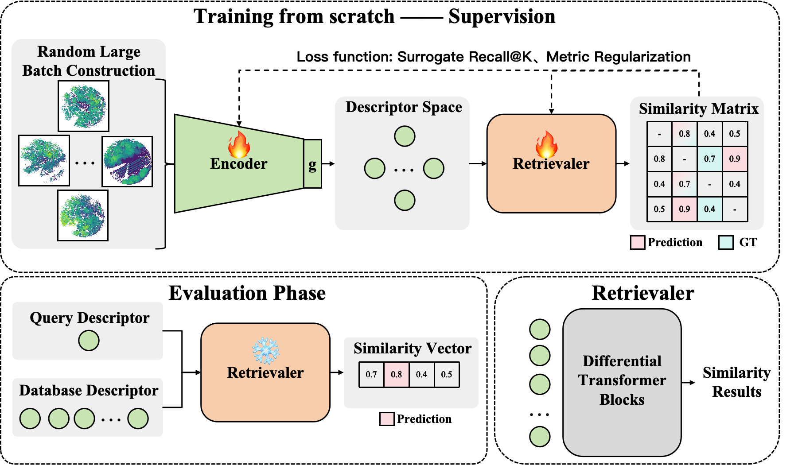

# Overall

- 面向任务：Lidar Place Recognition
- 解决问题：现有方法均在某种传统度量（欧式距离、余弦距离、马氏距离）下衡量两个样本映射到Descriptor后的相似度，这限制了learning-based descriptor的可表征空间，会把数据间的relation和descriptor分布限制在一个规则流形（超球面等）上。
- 解决思路：提出learning-based retrieval module，基于参数化可学习的retrieval module去度量两个descriptor之间的相似性。
- 目标：达到甚至超过传统度量的检索性能，并从理论上证明learning-based retrieval可靠性和有效性。
- 理想情况：最好能够通过few-shot or unsupervised or weak-supervised or zero-shot形式完成我们的目标。

## 方案Rollout

### 2026-05-08 Supervised based training from scratch

- retrieval module (retrievaler): 由差分transformer block组成，最后一层只导出attention score作为similarity score
	- training mode: 输出similarity matrix，任意两个data之间的相似度
	- inference mode: 仅计算query和database之间的similarity。
- training: 随机采样large scale batch, 映射成descriptor，再输入到retrievaler中得到similarity matrix，用可微 Recall@K / ranking-oriented surrogate loss 和作为相似度度量机制本身的一些理论规律先验来正则化约束retrievaler。
- eval：单纯计算query和database之间的similarity，根据similarity得到检索结果。

## Relevance

相关论文暂不随 codebase 同步 PDF，只保留对设计有用的结论：RAILS 指出固定点积/余弦相似度存在低秩表达瓶颈，learned similarity 必须同时处理表达力和可检索性；LOCORE 的 list-wise re-ranking、query/global attention anchor、gallery shuffled training 和 sliding-window 推理，为我们的 set-wise cross-encoder retrievaler 提供了最直接的结构参考；cross-encoder scalable indexing 相关工作提醒我们不能只做 brute-force 全库交叉编码，因此 v1 采用 chunk-wise screening + dustbin calibration + stage-2 re-scoring；HOTFormerLoc / HOTFLoc++ 则提供 LiDAR place recognition backbone、global descriptor 来源和 re-ranking baseline，使第一版可以先落在 frozen backbone + pooling 微调 + learned retrievaler 的实验路径上。

## Notes

- [Retrievaler v1 Rollout](Retrievaler-v1-rollout.md)
- [Pipeline slides](pipeline.pptx)

## Codebase

- Local codebase: `codebase/HOTFormerLoc`
- Default sync remote: `git@github.com:name555difficult/LPR_learn_retrievaler.git`
- Upstream source: `git@github.com:csiro-robotics/HOTFormerLoc.git`
