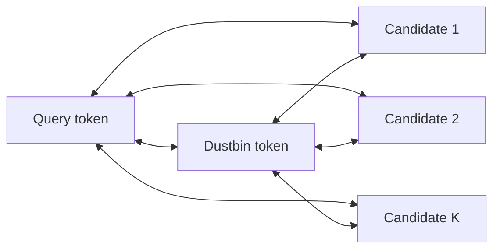
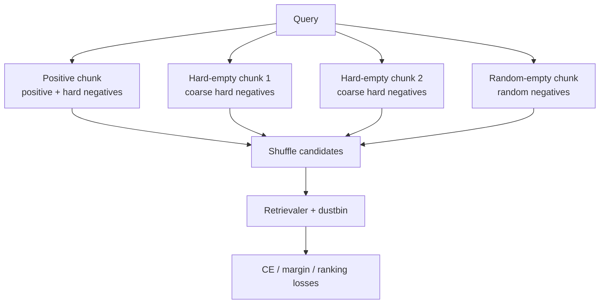
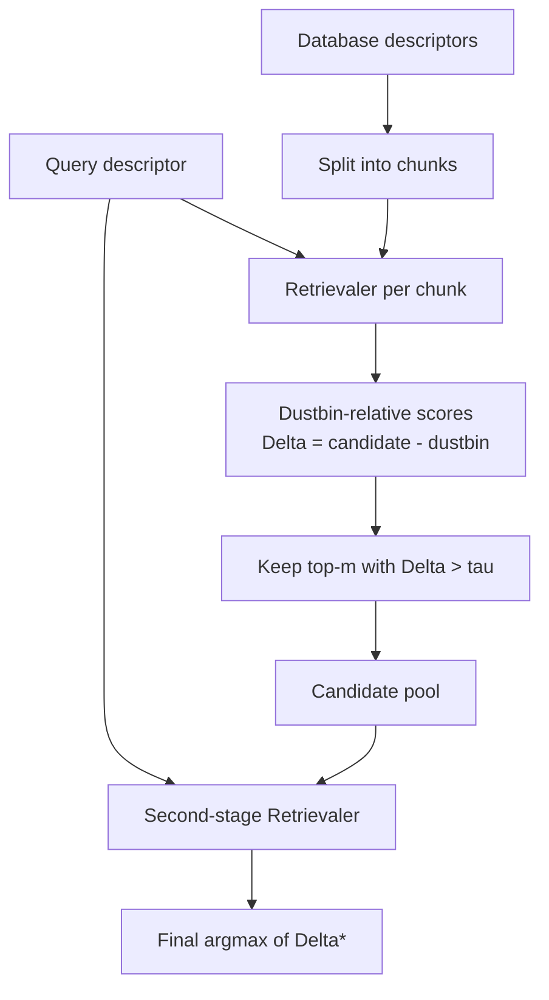

# Retrievaler v1 Rollout

> [!abstract] Core Idea
> 第一版 Retrievaler 定位为一个 **Dustbin-Calibrated Set-wise Cross-Encoder**：给定 query global descriptor 和一个 database chunk 的 global descriptors，模型以 list-wise 方式输出候选相似度，并用 dustbin token 表示“当前 chunk 没有可靠正样本”。测试时先分块检索，再把各块保留的候选合并进行二阶段重打分。


## Motivation

当前 Project-Learning Retrievaler 的核心假设是：LiDAR Place Recognition 不一定必须依赖欧式距离、余弦距离或马氏距离这类固定度量。固定度量把 descriptor relation 限制在规则几何空间中，而 cross-encoder retrievaler 可以直接学习 query 与候选集合之间的条件相关性。

相关论文暂不随 codebase 同步 PDF，只保留对设计有用的结论：RAILS 指出固定点积/余弦相似度存在低秩表达瓶颈，learned similarity 必须同时处理表达力和可检索性；LOCORE 的 list-wise re-ranking、query/global attention anchor、gallery shuffled training 和 sliding-window 推理，为我们的 set-wise cross-encoder retrievaler 提供了最直接的结构参考；cross-encoder scalable indexing 相关工作提醒我们不能只做 brute-force 全库交叉编码，因此 v1 采用 chunk-wise screening + dustbin calibration + stage-2 re-scoring；HOTFormerLoc / HOTFLoc++ 则提供 LiDAR place recognition backbone、global descriptor 来源和 re-ranking baseline，使第一版可以先落在 frozen backbone + pooling 微调 + learned retrievaler 的实验路径上。

> [!important] v1 Scope
> v1 暂时只使用 **global descriptors**，因此不插入 LOCORE 风格的 `[SEP]` token。每个 candidate token 已经代表一个完整 point cloud / place descriptor。

## Design Decisions

1. **List-wise input**：一次输入 query 与 $K$ 个候选，而不是单独计算 $K$ 个 query-candidate pair。
2. **Dustbin token**：增加一个可学习的 no-match token，允许模型拒绝当前 chunk。
3. **Attention mask**：用 query / dustbin 作为 attention anchor，控制候选间交互复杂度。
4. **Gallery shuffled training**：训练时打乱 chunk 内 candidate 顺序，避免模型学习 coarse retrieval 的位置 shortcut。
5. **Two-stage chunk retrieval**：先分块筛选，再把所有 surviving candidates 合并重打分。

## Notation

给定 LiDAR encoder $g_\theta$，点云 $x$ 的 global descriptor 为

$$
\mathbf{d}= \operatorname{norm}(g_\theta(x)) \in \mathbb{R}^{C}.
$$

对一个 query descriptor $\mathbf{q}$ 和一个 database chunk

$$
\mathcal{C} = \{\mathbf{c}_1,\ldots,\mathbf{c}_K\},
$$

Retrievaler 的输入 token 为

$$
\mathbf{T}^{(0)}
=
\left[
\mathbf{W}_q\mathbf{q}+\mathbf{e}_q,\;
\mathbf{z}_\varnothing+\mathbf{e}_\varnothing,\;
\mathbf{W}_c\mathbf{c}_1+\mathbf{e}_c,\ldots,
\mathbf{W}_c\mathbf{c}_K+\mathbf{e}_c
\right],
$$

其中：

- $\mathbf{z}_\varnothing$ 是 learnable dustbin token。
- $\mathbf{e}_q,\mathbf{e}_\varnothing,\mathbf{e}_c$ 是 token type embeddings。
- candidate token 不使用 absolute rank positional embedding。
- chunk 内候选顺序在训练时随机打乱。

## Attention Mask

v1 主方案建议使用 **query-dustbin star attention**：

$$
A_{ij}=1
\quad \Longleftrightarrow \quad
i \in \{q,\varnothing\}
\;\lor\;
j \in \{q,\varnothing\}
\;\lor\;
i=j.
$$

也就是说：

- query 可以 attend 所有候选与 dustbin。
- dustbin 可以 attend query 与所有候选。
- candidate 主要 attend query、dustbin 和自己。
- 候选间不直接全量互相 attend，候选集合信息通过 query / dustbin register 传播。



> [!warning] Attention Consistency
> 训练和测试最好使用同一种 attention mask。若训练时 full attention、测试时 query-only attention，模型可能在训练中依赖 candidate-candidate interaction，测试时出现分布偏移。这个版本可以把 full attention 作为 ablation，而不是默认主线。

复杂度：

$$
\mathcal{O}(K C^2 + K C)
$$

其中 attention connectivity 随 $K$ 近似线性增长；相比 full attention 的 $\mathcal{O}(K^2)$ 更适合大 chunk。

## Scoring

经过 $L$ 层 Retrievaler：

$$
\mathbf{T}^{(L)} = F_\phi(\mathbf{T}^{(0)}, A).
$$

对 dustbin 和每个 candidate 输出 scalar logit：

$$
s_\varnothing = h_\phi(\mathbf{t}^{(L)}_\varnothing),
\qquad
s_i = h_\phi(\mathbf{t}^{(L)}_i), \quad i=1,\ldots,K.
$$

最终用于跨 chunk 合并的分数不是 $s_i$ 本身，而是 **dustbin-relative score**：

$$
\Delta_i = s_i - s_\varnothing.
$$

解释：

- $\Delta_i > 0$：candidate $i$ 比 dustbin 更可信，可以进入候选池。
- $\Delta_i \le 0$：当前 chunk 对 candidate $i$ 的证据不超过 no-match 假设。
- $\Delta_i$ 使不同 chunk 的分数有一个局部 calibration anchor。

## Training Chunks

对同一个 query，训练时不要只采一个 chunk，而是采多种 chunk：

1. **Positive chunk**：包含至少一个真实正样本，并加入 coarse retrieval hard negatives。
2. **Hard-empty chunks**：不含真实正样本，但由 coarse retrieval 排名前列的 hard negatives 构成。
3. **Random-empty chunks**：不含真实正样本，由随机 negatives 构成，用于防止 dustbin 只适配 hard mining 偏差。



> [!tip] Sampling Principle
> Dustbin 是否真的有效，主要取决于 hard-empty chunk 的质量。随机 empty chunk 太容易，模型可能只学会拒绝简单负样本；hard-empty chunk 才能训练“高相似但无正样本时仍然拒绝”的能力。

## Loss

令 chunk 的正样本索引集合为 $\mathcal{P}\subseteq\{1,\ldots,K\}$。定义 logit 向量：

$$
\mathbf{s} = [s_\varnothing, s_1,\ldots,s_K].
$$

### Classification Loss

如果 $\mathcal{P}=\emptyset$，则 target 为 dustbin：

$$
y_\varnothing=1,\qquad y_i=0.
$$

如果 $\mathcal{P}\neq\emptyset$，则 target 为正样本候选：

$$
y_\varnothing=0,\qquad
y_i=
\begin{cases}
\frac{1}{|\mathcal{P}|}, & i\in\mathcal{P}\\
0, & i\notin\mathcal{P}.
\end{cases}
$$

交叉熵：

$$
\mathcal{L}_{\mathrm{CE}}
=
-\sum_{j\in\{\varnothing,1,\ldots,K\}}
y_j
\log
\frac{\exp(s_j)}{\exp(s_\varnothing)+\sum_{i=1}^K \exp(s_i)}.
$$

### Dustbin Margin Loss

Positive chunk：

$$
\mathcal{L}_{\mathrm{db}}^{+}
=
\frac{1}{|\mathcal{P}|}
\sum_{i\in\mathcal{P}}
\left[m - (s_i-s_\varnothing)\right]_+.
$$

Empty chunk：

$$
\mathcal{L}_{\mathrm{db}}^{\emptyset}
=
\left[m + \max_i(s_i-s_\varnothing)\right]_+.
$$

### Candidate Ranking Loss

对于 positive chunk，可加入正负候选间 margin：

$$
\mathcal{L}_{\mathrm{rank}}
=
\left[
m
+ \max_{j\notin\mathcal{P}} s_j
- \max_{i\in\mathcal{P}} s_i
\right]_+.
$$

总 loss：

$$
\mathcal{L}
=
\mathcal{L}_{\mathrm{CE}}
+ \lambda_{\mathrm{db}}\mathcal{L}_{\mathrm{db}}
+ \lambda_{\mathrm{rank}}\mathcal{L}_{\mathrm{rank}}
+ \lambda_{\mathrm{reg}}\mathcal{L}_{\mathrm{reg}}.
$$

后续可以把 surrogate Recall@K 加为 $\mathcal{L}_{\mathrm{rank}}$ 的替代或补充。

## Inference

测试分两阶段。

### Stage 1: Chunk-wise Screening

将 database $\mathcal{D}$ 分为若干 chunk：

$$
\mathcal{D}=\mathcal{C}^{(1)}\cup \cdots \cup \mathcal{C}^{(B)}.
$$

对每个 chunk，运行一次 Retrievaler：

$$
[s_\varnothing^{(b)},s_1^{(b)},\ldots,s_K^{(b)}]
=
F_\phi(\mathbf{q},\mathcal{C}^{(b)}).
$$

计算 dustbin-relative score：

$$
\Delta_i^{(b)}
=
s_i^{(b)}-s_\varnothing^{(b)}.
$$

每个 chunk 保留：

$$
\operatorname{TopM}
\left(
\left\{
i:\Delta_i^{(b)}>\tau
\right\}
\right).
$$

### Stage 2: Candidate Re-scoring

把所有 Stage 1 surviving candidates 合并：

$$
\mathcal{S}
=
\bigcup_b
\operatorname{TopM}_b.
$$

再运行一次 Retrievaler：

$$
[s_\varnothing^\star, \{s_i^\star\}_{i\in\mathcal{S}}]
=
F_\phi(\mathbf{q},\mathcal{S}).
$$

最终输出：

$$
i^\star
=
\arg\max_{i\in\mathcal{S}}
\left(
s_i^\star-s_\varnothing^\star
\right).
$$

若

$$
\max_{i\in\mathcal{S}}
(s_i^\star-s_\varnothing^\star)
\le \tau^\star,
$$

则模型可以输出 no reliable match。



### Pseudocode

```python
pool = []

for chunk in split_database(database, chunk_size=K):
    logits = retrievaler(query, chunk)
    dustbin = logits[0]
    candidate_logits = logits[1:]
    scores = candidate_logits - dustbin

    keep = topk(scores, k=m)
    pool.extend([chunk[i] for i in keep if scores[i] > tau])

final_logits = retrievaler(query, pool)
final_scores = final_logits[1:] - final_logits[0]
answer = pool[argmax(final_scores)]
```

## Why This Can Differ From LOCORE

LOCORE 的核心是 local descriptor list-wise re-ranking。v1 Retrievaler 的差异是：

| Aspect | LOCORE | Retrievaler v1 |
|---|---|---|
| Input | query local descriptors + gallery local descriptors | query global descriptor + candidate global descriptors |
| Boundary token | `[SEP]` per image | no `[SEP]` in v1 |
| Open-set rejection | no explicit dustbin | explicit dustbin token |
| Score calibration | list-local score | dustbin-relative score |
| Inference | sliding-window re-ranking | chunk screening + second-stage re-scoring |
| Key risk | long context and local descriptor quality | dustbin calibration and hard-empty mining |

> [!note] Main Novelty Candidate
> 最值得强调的不是“用了更快 transformer”，而是 **chunk-wise open-set retrieval**：每个 chunk 都允许模型选择 dustbin，从而避免分块检索时每块都被迫产生一个伪最高分。

## Evaluation Plan

### Retrieval Metrics

- Recall@1 / Recall@5 / Recall@N
- Average Recall under different positive radii
- final top-1 success rate after Stage 2

### Dustbin Metrics

- Empty chunk false accept rate:

$$
\operatorname{FAR}_{empty}
=
\Pr\left[
\max_i \Delta_i > \tau
\mid
\mathcal{P}=\emptyset
\right].
$$

- Positive chunk reject rate:

$$
\operatorname{FRR}_{pos}
=
\Pr\left[
\max_{i\in\mathcal{P}}\Delta_i \le \tau
\mid
\mathcal{P}\neq\emptyset
\right].
$$

- Candidate survival recall after Stage 1:

$$
\operatorname{Survival@M}
=
\Pr[
\exists i\in\mathcal{P}: i\in\mathcal{S}
].
$$

### Efficiency Metrics

- chunk size $K$
- kept candidates per chunk $m$
- Stage 1 total forward count
- Stage 2 candidate pool size
- latency / memory / throughput

## Ablations

| ID | Variant | Purpose |
|---|---|---|
| A0 | cosine / Euclidean baseline | fixed metric lower bound |
| A1 | list-wise full attention without dustbin | learned scorer without rejection |
| A2 | full attention + dustbin | test dustbin value without sparse mask |
| A3 | query-dustbin star attention + dustbin | v1 main design |
| A4 | no gallery shuffle | verify position shortcut risk |
| A5 | no hard-empty chunks | verify dustbin hard-negative calibration |
| A6 | one-stage chunk retrieval only | verify Stage 2 re-scoring value |
| A7 | raw score $s_i$ vs relative score $\Delta_i$ | verify dustbin calibration |
| A8 | train full attention, test query-only attention | measure attention-pattern shift risk |

## Implementation Notes

- Descriptor inputs should be L2-normalized before projection.
- Use shared candidate projection $\mathbf{W}_c$ for all candidates.
- Do not use absolute candidate position embedding in v1.
- Type embeddings are useful: query / dustbin / candidate.
- Use the same attention mask in training and testing for the main result.
- In Stage 1, tune $(K,m,\tau)$ by validation survival recall and false accept rate.
- In Stage 2, tune $\tau^\star$ only if the task permits no-match output.

## Open Questions

- Dustbin token should be a single global parameter, or query-conditioned by an MLP?
- Stage 2 candidate pool size may be variable. Should it be padded to a fixed $K^\star$ or processed dynamically?
- Should hard-empty chunks be mined online from the current encoder, or offline from a frozen coarse retriever?
- If future versions use HOTFormerLoc multi-scale local tokens, should `[SEP]` scoring tokens be reintroduced?
- Can $\Delta_i$ be theoretically interpreted as a learned likelihood ratio between match and no-match hypotheses?

## Short Name Candidates

- Dustbin-Calibrated Retrievaler
- Open-Set Chunk Retrievaler
- Set-wise Cross-Encoder Retrievaler
- DC-Retrievaler
